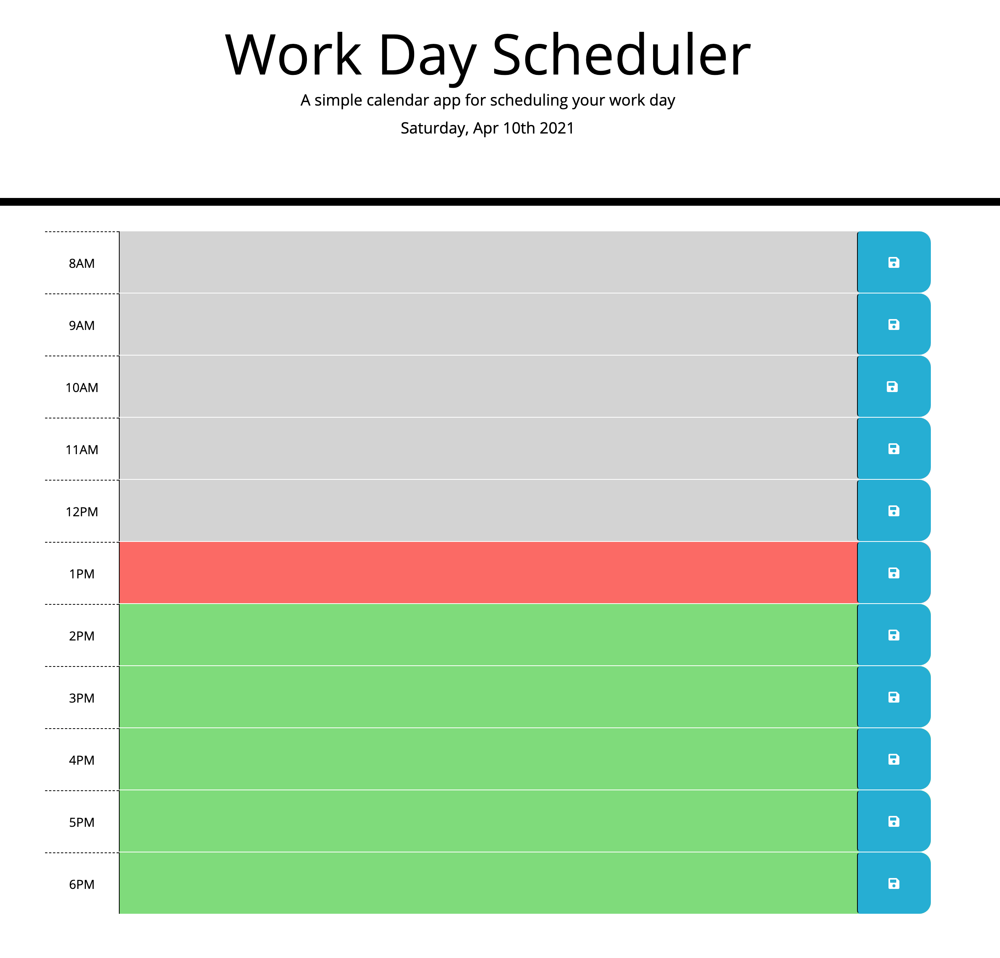
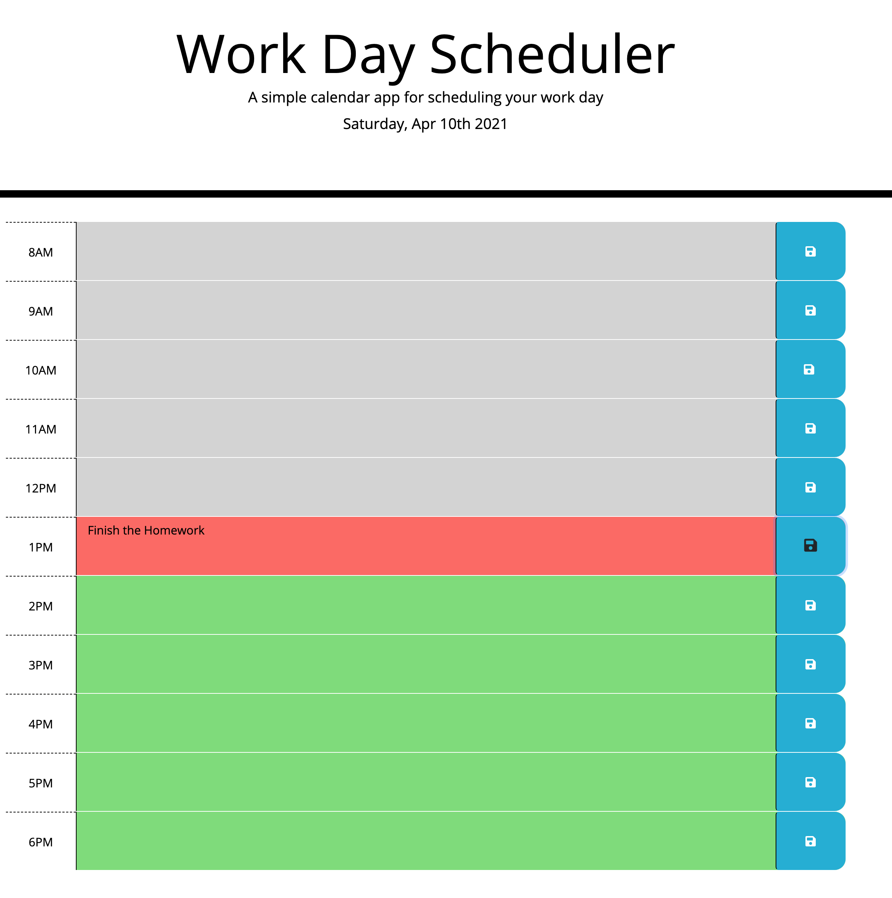
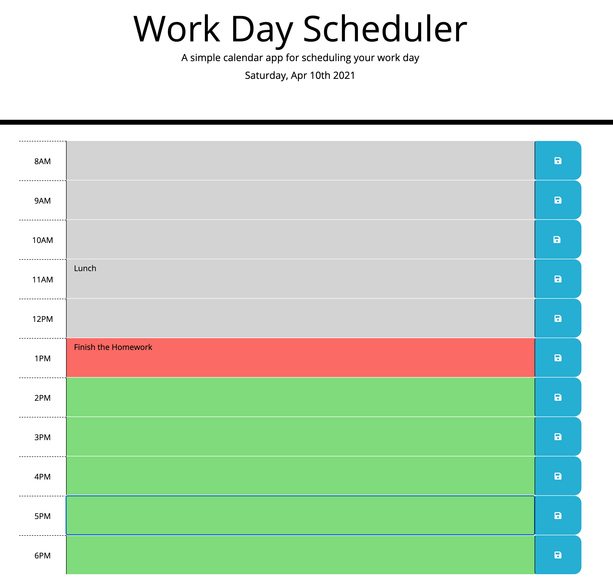

# 📅 [Work Day Scheduler](https://izaack89.github.io/day-planner/)

This Day Planner will help you to organize your daily activities and check with a friendly front-end that will let you know if the hour is on the past, the current hour and on the future

## Work Day Scheduler Elements

1. Localstorage: Is used to save the information of the activities of the hour of the day

2. momentJs: Is used to get the time and do formats

3. Jquery;: Is used to manipulate elemets

## [Work Day Scheduler GitHub Code](https://github.com/izaack89/code-base)

## Work Day Scheduler References

- [parent](https://api.jquery.com/parent/) - parent Function
- [find](https://api.jquery.com/find/) - find Function
- [addClass](https://api.jquery.com/addClass/) - add Function
- [each](https://api.jquery.com/jquery.each/) - each Iteration
- [readonly](https://stackoverflow.com/questions/3297923/make-textarea-readonly-with-jquery) - readonly element jquery
- [Format MomentJs](https://momentjs.com/docs/#/displaying/format/) - time Format

## Author

- **German Ramirez** - [GitHub](https://github.com/izaack89/)
